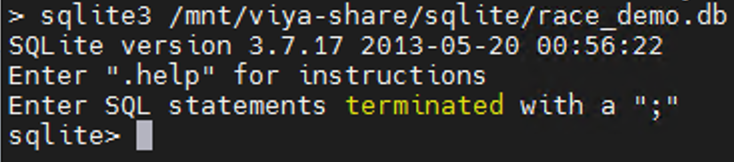

# Ingesting data into SQLite using the SAS Micro Analytic Service (MAS)

A tutorial that shows how the SAS Micro Analytic Service (MAS) can be used to ingest data into SQLite.

## Table of Contents

* [Overview](#overview)
	* [Prerequisites](#prerequisites)
	* [What is MAS?](#what-is-mas)
	* [How do I use MAS in an ESP project?](#how-do-i-use-mas-in-an-esp-project)
* [Getting Started](#getting-started)
* [Running the project](#running-the-project)
* [Troubleshooting](#troubleshooting)
* [Contributing](#contributing)
* [License](#license)
* [Additional Resources](#additional-resources)

## Overview

A SAS ESP data stream can be stored in a SQLite table in a couple different ways:

- Through the Database Adapter
- Using a combination of **Python** and the SAS Micro Analytic Service

This tutorial focuses on the latter solution.

### Prerequisites

On a standard Viya4 installation, MAS comes with its own internal Python deployment characterized by a limited number of packages. Even though the ingestion of a data stream into SQLite doesn't require any additional packages as Python comes with one for it by default, any others that might be needed for the completion of a project have to be added individually. Since the internal Python deployment is read-only, a patch is required for the Kubernetes MAS deployment to override the default Python installation. The implementation of the patch as well as the installation of the SAS SWAT package are beyond the scope of this tutorial. The ESP project as well as the data used in this entry can be found inside the [Demo data](Demo Data) folder.

### What is MAS?

A memory-resident, high-performance program execution service, the SAS Micro Analytic Service is multi-threaded and can be clustered for high availability. It can host multiple programs simultaneously, as well as multiple user or business contexts that are isolated from one another. It provides hosting for **DS2** and **Python** programs and supports a “compile-once, execute-many-times” usage pattern.

SAS Micro Analytic Service contains a core engine that is written in C for high performance and, when deployed as part of SAS® Event Stream Processing, includes **C++** classes that integrate with SAS Event Stream Processing. These capabilities allow both to execute within the same process space for maximum performance. The combination of SAS Event Stream Processing and SAS Micro Analytic Service enables SAS analytics, business logic, and user-written programs to operate on streams of data in motion.

### How do I use MAS in an ESP project?

MAS modules are embedded in an ESP project using the **<mas-modules>** and **</mas-modules>** XML tags. A project can specify more than one module. Each module has to be embedded between its **<mas-module>** and **</mas-module>** XML tags. MAS modules are generally defined at the top of the project, between the **<metadata>** and the **<contqueries>** tags. Here is an example of a MAS module written in Python for the Sample_Project7 ESP project:

		<mas-module module="Python_Module" language="python" func-names="sqlite_load">
		<description><![CDATA[Sliding window summary statistics]]></description>
		<code><![CDATA[import sqlite3
	from sqlite3 import Error

	def sqlite_load(SENSOR_ID, LATITUDE, LONGITUDE, MEASURE_ID, TIMESTAMP, TEMPERATURE, TURBIDITY, BATTERY_LIFE):
		"Output: "
		database = "/mnt/viya-share/sqlite/race_demo.db"

		# create a database connection
		conn = None
		try:
			conn = sqlite3.connect(database)

		except Error as e:
			print(e)
			return

		with conn:
			# Once we have a connection, start inserting records
			cur = conn.cursor()
			cur.execute('CREATE TABLE IF NOT EXISTS READINGS (SENSORID char(40), LATITUDE double, LONGITUDE double, MEASUREID char(50), DT timestamp, TEMPERATURE double, TURBIDITY double, BATTERY_LIFE double)')
			cur = conn.cursor()
			cur.execute('CREATE TABLE IF NOT EXISTS TURBIDITY_ALERTS (SENSORID char(40), LATITUDE double, LONGITUDE double, DT timestamp, TURBIDITY double, SEVERITY char(10))')
			cur = conn.cursor()
			cur.execute('CREATE TABLE IF NOT EXISTS BATTERY_ALERTS (SENSORID char(40), LATITUDE double, LONGITUDE double, DT timestamp, BATTERY_LIFE double, SEVERITY char(10))')

			readings_values = (SENSOR_ID, LATITUDE, LONGITUDE, MEASURE_ID, TIMESTAMP, TEMPERATURE, TURBIDITY, BATTERY_LIFE);
			sqlstmt = ''' INSERT INTO READINGS(SENSORID, LATITUDE, LONGITUDE, MEASUREID, DT, TEMPERATURE, TURBIDITY, BATTERY_LIFE) VALUES(?,?,?,?,?,?,?,?) '''

			cur = conn.cursor()
			cur.execute(sqlstmt, readings_values)

			if TURBIDITY and TURBIDITY > 1:
				if TURBIDITY >= 5:
					severity = 'ALERT'
				else:
					severity = 'WARNING'

				turbidity_alerts_values = (SENSOR_ID, LATITUDE, LONGITUDE, TIMESTAMP, TURBIDITY, severity);
				sqlstmt = ''' INSERT INTO TURBIDITY_ALERTS(SENSORID, LATITUDE, LONGITUDE, DT, TURBIDITY, SEVERITY) VALUES (?,?,?,?,?,?) '''
				cur = conn.cursor()
				cur.execute(sqlstmt, turbidity_alerts_values)

			if BATTERY_LIFE and BATTERY_LIFE < 5:
				if BATTERY_LIFE >= 4:
					severity = 'WARNING'
				elif BATTERY_LIFE <= 2:
					severity = 'ALERT'

				battery_alerts_values = (SENSOR_ID, LATITUDE, LONGITUDE, TIMESTAMP, BATTERY_LIFE, severity);
				sqlstmt = ''' INSERT INTO BATTERY_ALERTS(SENSORID, LATITUDE, LONGITUDE, DT, BATTERY_LIFE, SEVERITY) VALUES (?,?,?,?,?,?) '''
				cur = conn.cursor()
				cur.execute(sqlstmt, battery_alerts_values)

		return]]></code>
		</mas-module>

In this example, the name of the module is **Python_module**, and its associated function is called **sqlite_load**. These two pieces of information are required to run the module. If multiple cascading functions are present, make note of the name of the main function that calls the others, as that function will be used as an input parameter in the window that invokes the MAS module. The **sqlite_load** function requires eight arguments, which are all passed (for each record being processed) by the window that invokes the MAS module (**Sqlite_load**). Another important aspect is represented by the **"Output: <var1> ,<var2>,... <varN>"** statement. This statement determines whether the main function returns any values to a window, along with the name of the variables that store them. The notation must be specified even when a function doesn't return a value, as in our case.
The rest of the code is pretty standard from a database standpoint. If a connection can be gained, three tables are created if needed, and records are then processed and inserted into the READINGS table one at a time. If the turbidity of the water exceeds a value of 5, an alert is inserted into the TURBIDITY_ALERTS table. A warning is inserted into the same object for records with values between 1 and 5. A similar process is used to populate the BATTERY_ALERTS table depending on how much battery life is left on the sensor.  
Following is how the MAS module is invoked:

        <window-calculate pubsub="true" index="pi_EMPTY" name="Sqlite_Load" algorithm="MAS">
          <schema>
            <fields>
              <field name="SENSOR_ID" type="string"/>
              <field name="LATITUDE" type="double"/>
              <field name="LONGITUDE" type="double"/>
              <field name="MEASURE_ID" type="string" key="true"/>
              <field name="TIMESTAMP" type="string"/>
              <field name="TEMPERATURE" type="double"/>
              <field name="TURBIDITY" type="double"/>
              <field name="BATTERY_LIFE" type="double"/>
            </fields>
          </schema>
          <mas-map>
            <window-map module="Python_Module" function="sqlite_load" revision="0" source="Join_Sensors_and_Measures"/>
          </mas-map>
        </window-calculate>

The list of fields specified comes from the "Join_Sensors_and_Measures" window, and is passed in its entirety to the **sqlite_load** function. It's useful to point out that the function doesn't need to read in all variables from the invoking window in order to preserve their value. The ones "not needed" will still be available after the function is called and can be passed on to the next window if necessary. Finally, as stated previously, notice the reference to the module name (**Python_Module**) as well as to the function name (**sqlite_load**). Both are used to uniquely identify the function within a module.

## Getting Started

Download and unpack the file containing the [sample](Demo data) data and ESP project. Open your browser and connect to SAS ESP Studio. After logging in, copy, paste, and customize the sample project as needed. Depending on your configuration, you might want to change the location of the SQLite database referenced in the Python code as well as the path for the sample readings and sensors files.

Sample project:

The sample files contains readings from sensors that capture things like water temperature and water turbidity, as well as data about the sensors and their geo-coordinates:

Readings:

Sensors:

The two sources are joined before the resulting data is passed to a MAS Python module that stores the readings into their own table, while at the same time creating two additional tables to store battery life and water turbidity alerts.

## Running the project

While in SAS ESP Studio, select the **ESP Servers** tab, then click on the cloud icon on the top-right side of the screen to select the Sample_Project7 project. Finally, click on the **OK** button to run it:

As the project runs, using a command similar to the one below connect to the SQLite database where the tables are being created and populated. Note that the name and location of the database is the one embedded in the Python code for the project:

Once connected, verify that the tables exist, and that data is being added to them:

Once the project finishes its execution, the READINGS table should end up having a little over 34K records.

## Troubleshooting

For the sample project to run, the SQLite database must exist. If not, errors are generated indicating the database cannot be accessed. This is also the case if the database exists but its permission bits are not set properly. Use caution if you decide to use a database different from the one specified in the project. The sample project should run out of the box with no changes needed. If ESP Studio doen't show the project in running status after you start it, it's recommended that you use a tool like **Lens** to troubleshoot the Kubernetes cluster, or ask someone to help you do the same if you are not familiar with Kubernetes.
If you want to make changes to the Python code, it's recommended that a copy of the project be made beforehand, or that the orignal project is exported to preserve the original code. Changes don't have to be tested via continuous submissions in SAS ESP Studio, They can be tested in SAS Studio too, as the reservation is configured to run Python programs in addition to standard SAS or CASL code.

# Contributing

We welcome your contributions! Please read CONTRIBUTING.md for details on how to submit contributions to this project.

# License

This project is licensed under the Apache 2.0 License.

# Additional Resources

* [SAS Micro Analytic Service Programming and Administration Guide](https://go.documentation.sas.com/doc/en/mascdc/v_010/masag/titlepage.htm?homeOnFail=)
* [Python Support in SAS Micro Analytic Service](https://go.documentation.sas.com/doc/en/mascdc/v_010/masag/p0gdkc98s0uaucn1gh5514i6bmp2.htm)
* [Publishing to SAS Micro Analytic Service in SAS Event Stream Processing](https://go.documentation.sas.com/doc/en/mascdc/v_010/masag/p0b1nz8zgyhir1n17w93a89ovfi4.htm)
